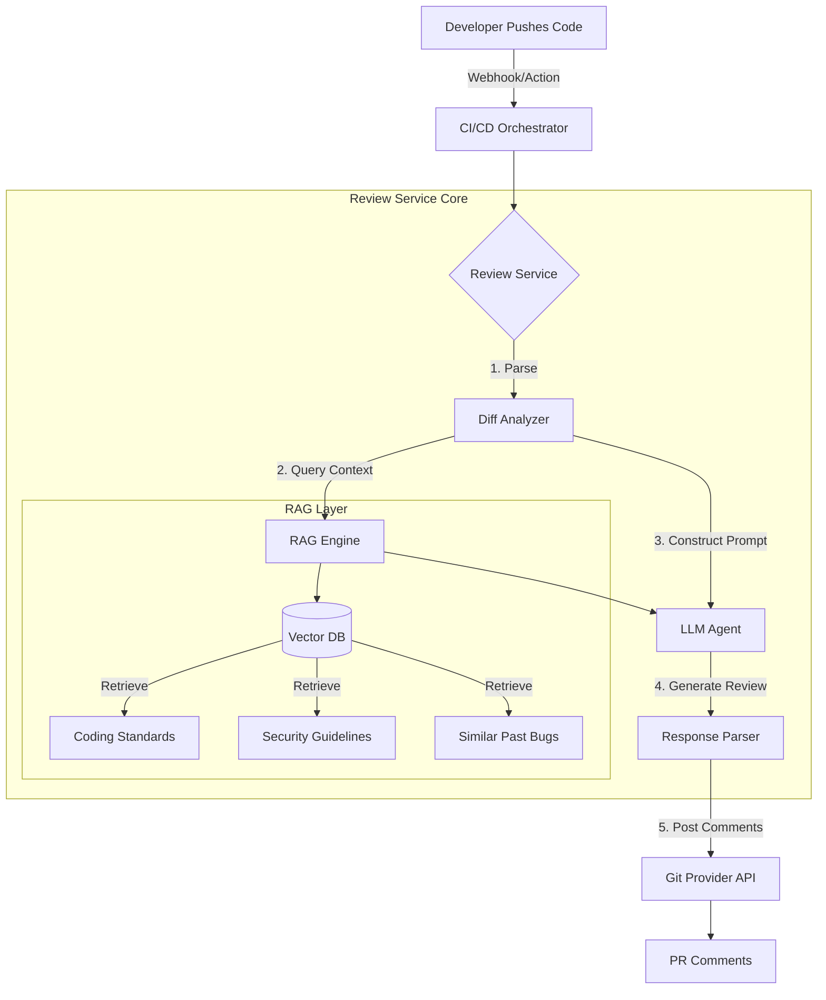

# AI-Powered Code Review Service: Architecture & Implementation Plan

## 1. Executive Summary
**Goal:** Automate code quality checks, style enforcement, and security vetting during the Pull Request (PR) process to reduce developer fatigue and catch issues early.
**Key Tech:** RAG (Retrieval-Augmented Generation), LLM (e.g., GPT-4/Claude 3.5), Vector Database, CI/CD Integration.
**Outcome:** Reduced review turnaround time, consistent code quality implementation, and 40% reduction in manual "nitpick" comments.

---

## 2. System Architecture

The system operates as an event-driven microservice triggered by CI/CD events.

### Core Components

1.  **Event Listener & Diff Analyzer**:
    *   **Input**: JSON payload from GitHub/GitLab webhook containing PR metadata and diffs.
    *   **Action**: Parses `git diff` to identify changed files and modified lines (hunks).
    *   **Optimization**: Filters out auto-generated files (lock files, mocks) and binary files.

2.  **RAG Engine (Context Layer)**:
    *   **Purpose**: Provides the "memory" and "rules" to the LLM so it reviews like a senior engineer of *your* team, avoiding generic advice.
    *   **Knowledge Base**:
        *   **Style Guides**: PEP8, Google Style Guide, or internal wikis.
        *   **Security Checklists**: OWASP Top 10 specifics for the stack.
        *   **Past Reviews**: High-quality past review comments indexed to learn "what good looks like".
    *   **Vector DB**: Pinecone housing embeddings (OpenAI `text-embedding-3-small` or similar).

3.  **LLM Orchestrator**:
    *   **Model**: GPT-4o or Claude 3.5 Sonnet (preferred for code reasoning).
    *   **Prompting Strategy**:
        *   *System Role*: "You are a senior tech lead. Be concise, actionable, and kind."
        *   *Context*: "Here are the relevant style rules for Python files in this repo..."
        *   *Task*: "Review the following diff. Flag severe bugs, security issues, and style violations. Ignore minor formatting if a linter catches it."

4.  **Feedback & Notification Service**:
    *   Interfaces with GitHub/GitLab/Bitbucket APIs.
    *   Posts inline comments on specific lines.
    *   Summarizes the review at the top level.

---

## 3. Implementation Plan

### Phase 1: MVP (The "Linter on Steroids")
*   **Goal**: Get basic feedback loop working.
*   **Scope**:
    *   Hardcoded prompt (no RAG yet).
    *   Integrated as a GitHub Action / GitLab Script.
    *   Focus on one language (e.g., Python).
*   **Steps**:
    1.  Write Python script to fetch PR diff using `Bitbucket API`.
    2.  Send diff chunks to LLM with a basic prompt: "Find bugs in this code."
    3.  Post raw LLM responses back as comments.

### Phase 2: RAG Integration (Context Awareness)
*   **Goal**: Reduce hallucinations and generic advice.
*   **Scope**:
    *   Ingest internal "Best Practices" documentation into Vector DB.
    *   Retrieve relevant docs based on file type or imports (e.g., if `boto3` is imported, retrieve AWS security guidelines).
*   **Steps**:
    1.  Set up Vector DB (e.g., Qdrant/Chroma).
    2.  Build ingestion pipeline for `.md` docs in the repo.
    3.  Updates prompt: "Using the following internal guidelines: {retrieved_docs}, review this code."

### Phase 3: "Reviewer Persona" & Calibration
*   **Goal**: Make the bot feel human and less annoying.
*   **Scope**:
    *   Separate concerns: Security vs. Style vs. Logic.
    *   Implement "Severity Levels" (Nitpick, Suggestion, Blocking).
    *   feedback loop: If users "thumbs down" a bot comment, use that to tune the prompt/context.

### Phase 4: Productionalization (Distributed & Scalable)
*   **Goal**: Handle high throughput across all microservices.
*   **Scope**:
    *   Deploy as a standalone Service (e.g., FastAPI + Celery workers) to handle webhooks.
    *   Caching layers (Redis) to avoid re-reviewing unchanged commits.
    *   Rate limiting and cost monitoring (Token usage tracking).

---

## 4. Key Technical Challenges & Solutions

| Challenge | Solution |
| :--- | :--- |
| **Context Window Limits** | Diff chunking (smart splitting by class/function). Summary-map-reduce approach for large PRs. |
| **Hallucinations** | Strict system prompts ("If unsure, say nothing"). RAG grounding. Temperature = 0. |
| **"Noise" / False Positives** | Instruct LLM to focus on *logic* and *security*, leaving *style* to standard linters (Black, ESLint). |
| **Security (Leaking Code)** | Use enterprise instances of LLM API (Azure OpenAI / AWS Bedrock) with Zero Data Retention policies. |
| **Cost** | Filter trivial files. Cache responses for identical code blocks or re-runs. |

## 5. Technology Stack Recommendations

*   **Language**: Python 3.11 (strong ecosystem for AI/LLM tools).
*   **Framework**: LangChain/LangGraph (for RAG chains) + FastAPI (webhook receiver).
*   **LLM Model**: GPT-4o (best reasoning) or Claude 3.5 Sonnet (excellent at code).
*   **Vector DB**: Qdrant (local/easy)
*   **Infrastructure**: Docker, AWS Lambda (for event-driven cost savings) or Kubernetes.
